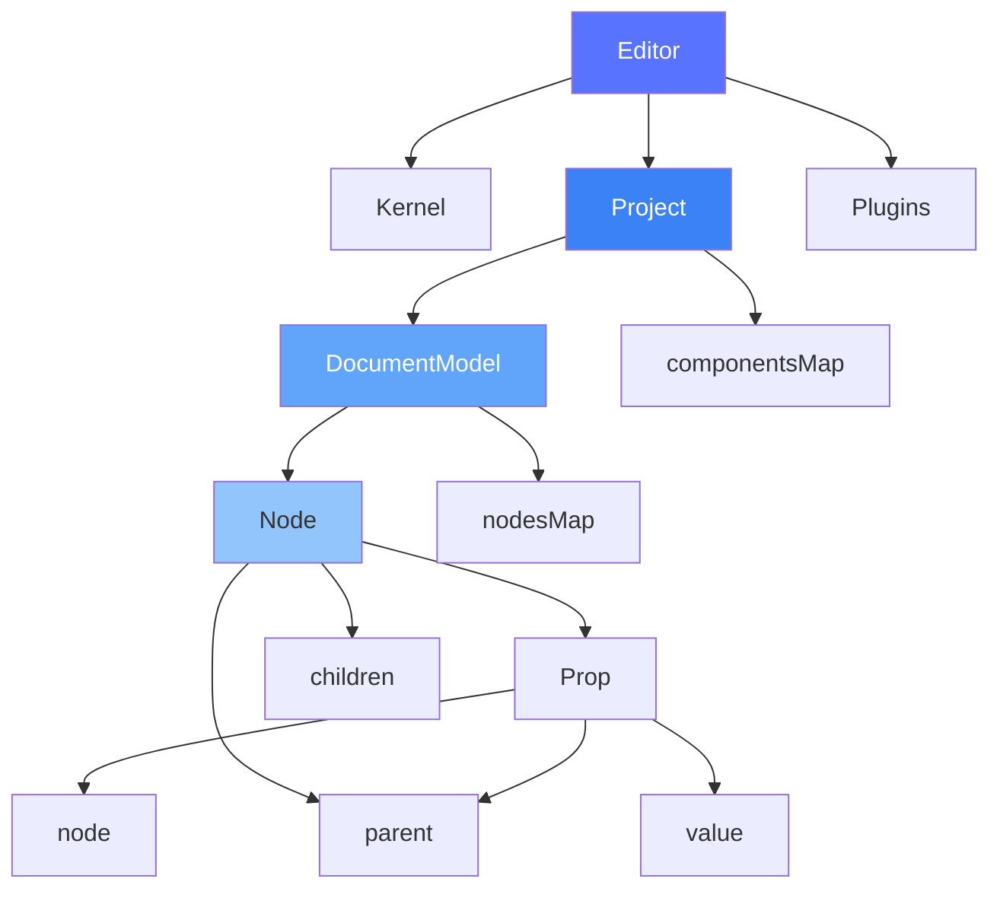

# 编辑器核心

本章节深入解析 `@alilc/lowcode-editor-core` 模块的架构设计和实现。

## 🎯 模块职责

`editor-core` 是 Lowcode Engine 的核心 API 模块，提供：

- 📝 **编辑器实例管理** - 全局编辑器单例
- 📊 **项目/文档模型** - 项目、文档、节点的数据结构
- 🛠️ **核心 API** - 组件、物料、插件等 API
- ⚡ **事件系统** - 事件发布和订阅
- 🔄 **状态管理** - MobX 状态同步

## 📁 模块结构

```
packages/editor-core/src/
├── api/                     # API 定义和实现
│   ├── editor.ts           # 编辑器 API
│   ├── canvas.ts           # 画布 API
│   ├── component.ts        # 组件 API
│   ├── material.ts         # 物料 API
│   ├── setting.ts          # 设置 API
│   ├── history.ts          # 历史记录 API
│   └── index.ts           # API 汇总导出
├── kernel/                  # 内核实现
│   ├── editor.ts           # 编辑器主类
│   ├── kernel.ts           # 内核核心
│   ├── project.ts          # 项目模型
│   ├── document.ts         # 文档模型
│   ├── node.ts             # 节点模型
│   └── prop.ts             # 属性模型
├── utils/                   # 工具函数
│   ├── log.ts              # 日志工具
│   ├── event.ts            # 事件工具
│   └── ...
├── types/                   # TypeScript 类型
│   └── index.ts
└── index.ts                 # 统一入口
```

## 🏗️ 核心类结构

### 1. Editor - 编辑器主类

```typescript
// packages/editor-core/src/kernel/editor.ts
import { action, observable } from 'mobx';
import { Kernel } from './kernel';
import { Project } from './project';
import { Plugins } from '../api/plugins';

export class Editor {
  @observable kernel: Kernel;
  @observable project: Project | null = null;
  
  // API 扩展
  canvas: ICanvasApi;
  component: IComponentApi;
  material: IMaterialApi;
  setting: ISettingApi;
  history: IHistoryApi;
  plugins: Plugins;
  
  // 初始化
  async init(config: IPublicModelEngineConfig): Promise<void> {
    // 1. 创建内核
    this.kernel = new Kernel(config);
    
    // 2. 注册默认插件
    await this.registerDefaultPlugins();
    
    // 3. 初始化 API
    this.setupApis();
    
    // 4. 暴露全局实例
    (window as any).editor = this;
  }
  
  // 插件注册
  async register(plugin: IPlugin): Promise<void> {
    return this.plugins.register(plugin);
  }
  
  // 创建项目
  @action
  async createProject(schema: IPublicModelProjectSchema): Promise<Project> {
    this.project = new Project(this, schema);
    return this.project;
  }
}
```

### 2. Kernel - 内核核心

```typescript
// packages/editor-core/src/kernel/kernel.ts
export class Kernel {
  editor: Editor;
  config: IPublicModelEngineConfig;
  
  // 状态
  @observable preference: Preference;
  @observable notifier: Notifier;
  
  constructor(config: IPublicModelEngineConfig) {
    this.config = config;
    this.preference = new Preference();
    this.notifier = new Notifier();
  }
  
  // 全局配置
  getStrictValidate(): boolean {
    return this.config?.strictValidateMode ?? false;
  }
}
```

### 3. Project - 项目模型

```typescript
// packages/editor-core/src/kernel/project.ts
export class Project {
  editor: Editor;
  
  @observable documents: DocumentModel[] = [];
  @observable currentDocument: DocumentModel | null = null;
  @observable componentsMap: ComponentMeta[] = [];
  @observable i18n: Record<string, any> = {};
  
  constructor(editor: Editor, schema: IPublicModelProjectSchema) {
    this.editor = editor;
    this.load(schema);
  }
  
  @action
  load(schema: IPublicModelProjectSchema) {
    // 加载组件映射表
    this.componentsMap = schema.componentsMap || [];
    
    // 加载国际化
    this.i18n = schema.i18n || {};
    
    // 加载文档
    if (schema.componentsTree) {
      schema.componentsTree.forEach(docSchema => {
        const doc = new DocumentModel(this, docSchema);
        this.documents.push(doc);
      });
      this.currentDocument = this.documents[0];
    }
  }
  
  // 导出 Schema
  export(): IPublicModelProjectSchema {
    return {
      componentsMap: this.componentsMap.map(m => m.export()),
      componentsTree: this.documents.map(d => d.export()),
      i18n: this.i18n
    };
  }
}
```

### 4. DocumentModel - 文档模型

```typescript
// packages/editor-core/src/kernel/document.ts
export class DocumentModel {
  project: Project;
  
  @observable root: Node | null = null;
  @observable nodesMap: Map<string, Node> = new Map();
  @observable importMap: Map<string, string> = new Map();
  
  constructor(project: Project, schema: IPublicModelDocumentSchema) {
    this.project = project;
    this.load(schema);
  }
  
  @action
  load(schema: IPublicModelDocumentSchema) {
    if (schema.root) {
      this.root = this.createNode(schema.root);
    }
  }
  
  createNode(schema: IPublicModelNodeSchema, parent?: Node): Node {
    const node = new Node(this, schema, parent);
    this.nodesMap.set(node.id, node);
    return node;
  }
  
  getNode(id: string): Node | null {
    return this.nodesMap.get(id) || null;
  }
  
  importReferences(): Map<string, string> {
    return this.importMap;
  }
}
```

### 5. Node - 节点模型

```typescript
// packages/editor-core/src/kernel/node.ts
import { observable, action, computed } from 'mobx';

export class Node {
  document: DocumentModel;
  parent: Node | null;
  
  @observable id: string;
  @observable componentName: string;
  @observable props: Prop;
  @observable children: Node[] = [];
  @observable hidden: boolean = false;
  @observable isLocked: boolean = false;
  @observable title?: string;
  
  constructor(document: DocumentModel, schema: any, parent?: Node) {
    this.document = document;
    this.parent = parent || null;
    this.id = schema.id || this.generateId();
    this.componentName = schema.componentName;
    this.props = new Prop(this, schema.props || {});
    this.hidden = !!schema.hidden;
    
    // 创建子节点
    if (schema.children) {
      const children = Array.isArray(schema.children) 
        ? schema.children 
        : [schema.children];
      children.forEach(childSchema => {
        this.children.push(new Node(document, childSchema, this));
      });
    }
  }
  
  // 添加子节点
  @action
  appendChild(child: Node) {
    child.parent = this;
    this.children.push(child);
    this.document.nodesMap.set(child.id, child);
  }
  
  // 移除节点
  @action
  remove() {
    if (this.parent) {
      const index = this.parent.children.indexOf(this);
      if (index > -1) {
        this.parent.children.splice(index, 1);
      }
    }
    this.document.nodesMap.delete(this.id);
  }
  
  // 导出 Schema
  export(): IPublicModelNodeSchema {
    return {
      componentName: this.componentName,
      props: this.props.export(),
      children: this.children.map(c => c.export()),
      hidden: this.hidden,
      id: this.id
    };
  }
}
```

### 6. Prop - 属性模型

```typescript
// packages/editor-core/src/kernel/prop.ts
export class Prop {
  node: Node;
  parent: Prop | Node;
  key: string;
  
  @observable value: any;
  @observable extraProps: Map<string, any> = new Map();
  
  constructor(nodeOrProp: Node | Prop, keyOrValue: string | any) {
    if (nodeOrProp instanceof Node) {
      this.node = nodeOrProp;
      this.parent = nodeOrProp;
      this.key = '';
      this.value = keyOrValue;
    } else {
      this.node = nodeOrProp.node;
      this.parent = nodeOrProp;
      this.key = keyOrValue as string;
    }
  }
  
  // 获取属性值
  get(key: string): any {
    const prop = this.getProp(key);
    return prop ? prop.value : undefined;
  }
  
  // 设置属性值
  @action
  set(key: string, value: any) {
    let prop = this.getProp(key);
    if (prop) {
      prop.value = value;
    } else {
      prop = new Prop(this, key);
      prop.value = value;
      this.extraProps.set(key, prop);
    }
  }
  
  private getProp(key: string): Prop | undefined {
    return this.extraProps.get(key);
  }
  
  // 导出
  export(): any {
    const result: any = { ...this.value };
    this.extraProps.forEach((prop, key) => {
      result[key] = prop.export();
    });
    return result;
  }
}
```

## 🔄 事件系统

```typescript
// packages/editor-core/src/utils/event.ts
export class EventEmitter {
  private events: Map<string, Set<Function>> = new Map();
  
  on(event: string, listener: Function): void {
    if (!this.events.has(event)) {
      this.events.set(event, new Set());
    }
    this.events.get(event)!.add(listener);
  }
  
  off(event: string, listener: Function): void {
    const listeners = this.events.get(event);
    if (listeners) {
      listeners.delete(listener);
    }
  }
  
  emit(event: string, ...args: any[]): void {
    const listeners = this.events.get(event);
    if (listeners) {
      listeners.forEach(listener => listener(...args));
    }
  }
  
  once(event: string, listener: Function): void {
    const wrapper = (...args: any[]) => {
      this.off(event, wrapper);
      listener(...args);
    };
    this.on(event, wrapper);
  }
}
```

## 📊 类关系图



## 🎯 核心 API

### 全局 API

```typescript
// 通过 editor 实例访问
editor.project           // 当前项目
editor.currentDocument   // 当前文档
editor.selection         // 选择管理
editor.history           // 历史记录
editor.materials         // 物料管理
editor.plugins           // 插件管理
editor.setting           // 设置管理
editor.canvas            // 画布管理
```

### 文档 API

```typescript
// 文档操作
document.getNode(id)           // 获取节点
document.selectNode(node)      // 选择节点
document.createNewNode(schema) // 创建新节点

// 导入导出
document.import(schema)        // 导入 Schema
document.export()              // 导出 Schema
```

### 节点 API

```typescript
// 节点操作
node.appendChild(child)        // 添加子节点
node.insertBefore(child)       // 插入到前面
node.remove()                  // 移除节点
node.serialize()               // 序列化
node.setOnset(key, value)      // 设置属性
```

## 📖 下一步

- 阅读 [渲染器架构](/architecture/renderer) 了解渲染原理
- 阅读 [引擎核心](/core/engine-core) 深入实现细节
- 阅读 [设计器](/core/designer) 了解设计器源码

---

上一篇：[Monorepo 结构](/architecture/monorepo) · 下一篇：[渲染器架构](/architecture/renderer)