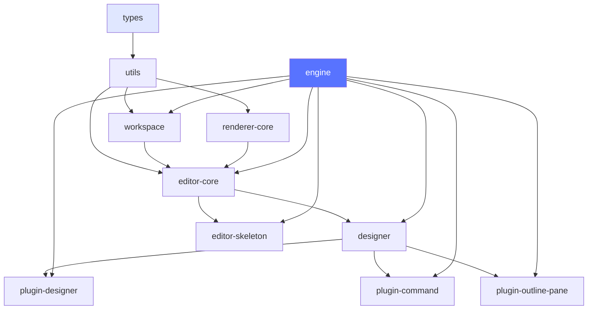

# Monorepo 结构

本章节解析 Lowcode Engine 的 Monorepo 项目管理方式和实践。

## 📦 什么是 Monorepo

Monorepo 是"单一仓库"的意思，将多个项目的代码存放在同一个 Git 仓库中。

### Monorepo vs Multirepo

| 特性 | Monorepo | Multirepo |
|------|----------|-----------|
| 仓库数量 | 单一仓库 | 多个仓库 |
| 依赖管理 | 统一版本管理 | 独立版本 |
| 代码共享 | 直接引用 | 通过包 |
| 原子提交 | ✅ 支持 | ❌ 不支持 |
| CI/CD | 统一构建 | 独立构建 |

## 🏗️ Lowcode Engine Monorepo 结构

```
lowcode-engine/
├── lerna.json                 # Lerna 配置文件
├── package.json               # 根项目配置
├── tsconfig.json              # 共享 TypeScript 配置
├── .eslintrc.js              # 共享 ESLint 配置
├── .prettierrc.js            # 共享 Prettier 配置
├── babel.config.js           # Babel 配置
├── scripts/                   # 构建脚本
│   ├── build.sh              # 构建脚本
│   └── release.sh            # 发布脚本
└── packages/                  # 所有包
    ├── engine/               # 📍 引擎入口
    ├── editor-core/          # 编辑器核心
    ├── designer/             # 设计器
    ├── editor-skeleton/      # 骨架层
    ├── renderer-core/        # 渲染器核心
    ├── react-renderer/       # React 渲染器
    ├── react-simulator-renderer/ # React 模拟器
    ├── workspace/            # 工作区
    ├── plugin-command/       # 命令插件
    ├── plugin-designer/      # 设计器插件
    ├── plugin-outline-pane/  # Outline 树插件
    ├── ignitor/              # 页面组装器
    ├── types/                # TypeScript 类型
    ├── utils/                # 工具函数
    └── shell/                # Shell API
```

## ⚙️ Lerna 配置

### lerna.json

```json
{
  "version": "1.3.2",
  "npmClient": "npm",
  "useWorkspaces": true,
  "packages": [
    "packages/*"
  ],
  "command": {
    "publish": {
      "message": "chore(release): publish %s"
    },
    "bootstrap": {
      "npmClientArgs": ["--no-package-lock"]
    }
  }
}
```

### package.json

```json
{
  "name": "lowcode-engine",
  "version": "1.3.2",
  "private": true,
  "description": "An enterprise-class low-code technology stack",
  "scripts": {
    "start": "lerna run start --scope=@alilc/lowcode-engine --stream",
    "build": "lerna run build",
    "test": "lerna run test",
    "clean": "lerna clean",
    "version:update": "node ./scripts/version.js"
  },
  "devDependencies": {
    "lerna": "^4.0.0",
    "@alib/build-scripts": "^0.1.18"
  }
}
```

## 📝 包结构约定

每个包的目录结构遵循统一规范：

```
packages/[package-name]/
├── src/                  # 源代码
│   ├── index.ts          # 统一入口
│   ├── types.ts          # 类型定义
│   └── ...
├── tests/                # 测试代码
│   ├── __tests__/
│   └── fixtures/
├── es/                   # ES Module 输出
├── lib/                  # CommonJS 输出
├── dist/                 # UMD 输出
├── package.json          # 包配置
├── tsconfig.json         # TypeScript 配置
└── README.md             # 说明文档
```

### 包配置示例

```json
{
  "name": "@alilc/lowcode-engine",
  "version": "1.3.2",
  "description": "Lowcode Engine core",
  "main": "lib/engine-core.js",
  "module": "es/engine-core.js",
  "files": [
    "dist",
    "es",
    "lib"
  ],
  "scripts": {
    "build": "build-scripts build",
    "test": "build-scripts test"
  },
  "dependencies": {
    "@alilc/lowcode-editor-core": "1.3.2",
    "@alilc/lowcode-designer": "1.3.2",
    "@alilc/lowcode-plugin-command": "1.3.2"
  }
}
```

## 🔗 依赖管理

### 版本对齐

Lerna 管理的所有包版本保持一致：

```json
// lerna.json
{
  "version": "1.3.2"
}
```

### 包间依赖

```json
{
  "name": "@alilc/lowcode-engine",
  "dependencies": {
    // 使用固定版本号
    "@alilc/lowcode-editor-core": "1.3.2",
    "@alilc/lowcode-designer": "1.3.2"
  }
}
```

### 依赖安装

```bash
# 安装所有依赖
npm install

# Lerna 会自动处理包间依赖
lerna bootstrap
```

## 🛠️ 构建流程

### 1. 构建顺序

Lerna 会根据依赖关系自动排序构建顺序：

```bash
$ lerna run build

# 构建顺序示例：
# 1. @alilc/lowcode-types (无依赖)
# 2. @alilc/lowcode-utils (依赖 types)
# 3. @alilc/lowcode-editor-core (依赖 types, utils)
# 4. @alilc/lowcode-designer (依赖 editor-core)
# 5. @alilc/lowcode-engine (依赖所有)
```

### 2. 构建脚本

使用统一的构建脚本：

```javascript
// scripts/build.js
const shell = require('shelljs');
const { getPackageDir } = require('./utils');

function buildPackage(packageName) {
  const dir = getPackageDir(packageName);
  shell.exec('npm run build', { cwd: dir });
}
```

### 3. 并行构建

```bash
# 并行构建所有包
lerna run build --parallel

# 带进度显示
lerna run build --stream
```

## 📋 最佳实践

### 1. 包命名规范

遵循 `@alilc/lowcode-xxx` 命名格式：

```
@alilc/lowcode-engine       # 引擎
@alilc/lowcode-editor-core  # 编辑器核心
@alilc/lowcode-designer     # 设计器
@alilc/lowcode-plugin-*     # 插件
```

### 2. 包依赖原则

- ✅ 📌 上层包依赖下层包
- ✅ 🚫 避免循环依赖
- ✅ 🔒 核心包不依赖业务包
- ✅ 📦 外部依赖版本统一

### 3. 版本号管理

```bash
# 查看当前版本
lerna version

# 更新版本
lerna version patch  # 1.3.2 -> 1.3.3
lerna version minor  # 1.3.3 -> 1.4.0
lerna version major  # 1.4.0 -> 2.0.0
```

## 🎯 开发流程

### 添加新包

```bash
# 创建新包
lerna create my-plugin

# 添加到 packages 目录
# packages/my-plugin/
```

### 本地开发

```bash
# 链路开发
npm link

# 修改代码后重新构建
lerna run build --scope=@alilc/lowcode-engine
```

### 依赖变更

```bash
# 添加依赖
lerna add lodash --scope=@alilc/lowcode-engine

# 移除依赖
lerna remove lodash --scope=@alilc/lowcode-engine
```

## 📊 依赖关系图



## 🚀 发布流程

### 1. 准备发布

```bash
# 运行测试
lerna run test

# 构建所有包
lerna run build

# 检查变更
lerna changed
```

### 2. 发布新版本

```bash
# 发布到 npm
lerna publish

# 按标签发布
lerna publish --dist-tag next

# 从指定版本发布
lerna publish 1.4.0
```

### 3. 发布后

```bash
# 同步到 CDN
tnpm syncOss

# 更新 diamond 配置
```

## 📖 参考资料

- [Lerna 官方文档](https://lerna.js.org/)
- [Monorepo 概念](https://monorepo.tools/)
- [Turborepo](https://turbo.build/repo)

---

上一篇：[整体架构](/architecture/overview) · 下一篇：[编辑器核心](/architecture/editor-core)