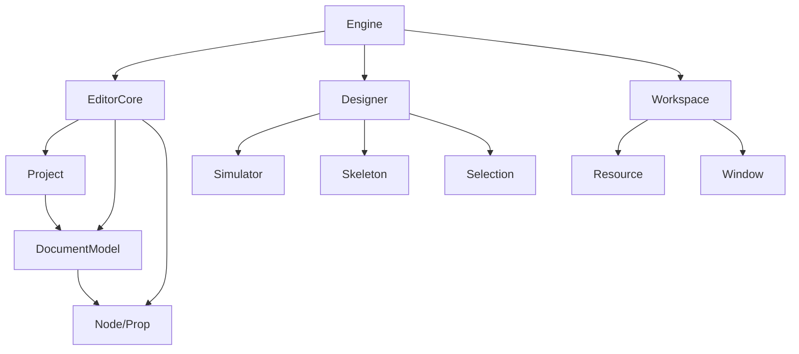

# 整体架构

本章节从架构视角解析 Lowcode Engine 的设计思想和整体结构。

## 🏗️ 架构设计目标

Lowcode Engine 的架构设计遵循以下核心目标：

### 1. 可扩展性（Extensibility）

- ✅ **插件化架构** - 核心功能通过插件实现，支持按需加载
- ✅ **协议标准化** - 基于 Schema 协议的标准化描述
- ✅ **组件化设计** - 功能模块高度解耦，可插拔

### 2. 高性能（Performance）

- ✅ **虚拟节点树** - 高效的节点树管理和 diff 算法
- ✅ **懒加载机制** - 物料和组件按需加载
- ✅ **增量渲染** - 只渲染变化的部分

### 3. 易用性（Usability）

- ✅ **可视化设计** - 所见即所得的设计体验
- ✅ **开发体验** - 完善 TypeScript 类型支持
- ✅ **调试友好** - Source Map 和调试工具支持

## 📐 整体架构图

```
┌─────────────────────────────────────────────────────────────┐
│                      Lowcode Engine                          │
├─────────────────────────────────────────────────────────────┤
│  ┌─────────────────────────────────────────────────────────┐ │
│  │                     应用层                               │ │
│  │  ┌─────────┐ ┌─────────┐ ┌─────────┐ ┌─────────┐        │ │
│  │  │物料市场  │ │插件中心  │ │业务组件  │ │ 页面流  │        │ │
│  │  └─────────┘ └─────────┘ └─────────┘ └─────────┘        │ │
│  └─────────────────────────────────────────────────────────┘ │
│  ┌─────────────────────────────────────────────────────────┐ │
│  │                     引擎层                               │ │
│  │  ┌─────────────────────────────────────────────────────┐ │ │
│  │  │                    Designer                         │ │ │
│  │  │  ┌──────────┐ ┌──────────┐ ┌──────────┐ ┌────────┐ │ │ │
│  │  │  │ 选择管理  │ │ 属性管理  │ │ 画布管理  │ │历史记录│ │ │ │
│  │  │  └──────────┘ └──────────┘ └──────────┘ └────────┘ │ │ │
│  │  └─────────────────────────────────────────────────────┘ │ │
│  │  ┌─────────┐ ┌─────────┐ ┌─────────┐ ┌─────────┐        │ │
│  │  │ 编辑器   │ │ 工作区   │ │ 骨架层   │ │ 模拟器  │       │ │
│  │  │ (Core)  │ │(Workspace)│ │(Skeleton)│ │(Simulator)│    │ │
│  │  └─────────┘ └─────────┘ └─────────┘ └─────────┘        │ │
│  └─────────────────────────────────────────────────────────┘ │
│  ┌─────────────────────────────────────────────────────────┐ │
│  │                     渲染层                               │ │
│  │  ┌─────────────────────────────────────────────────────┐ │ │
│  │  │                  Renderer Core                      │ │ │
│  │  │  ┌─────────┐ ┌─────────┐ ┌─────────┐ ┌─────────┐   │ │ │
│  │  │  │页面渲染   │ │组件渲染  │ │ 生命周期  │ │ 事件系统  │   │ │ │
│  │  │  └─────────┘ └─────────┘ └─────────┘ └─────────┘   │ │ │
│  │  └─────────────────────────────────────────────────────┘ │ │
│  │  ┌─────────┐ ┌─────────┐ ┌─────────┐ ┌─────────┐        │ │
│  │  │React 渲染 │ │ 小程序   │ │  H5     │ │ 自定义   │       │ │
│  │  │ Renderer │ │ Renderer │ │ Renderer│ │ Renderer │      │ │
│  │  └─────────┘ └─────────┘ └─────────┘ └─────────┘       │ │
│  └─────────────────────────────────────────────────────────┘ │
│  ┌─────────────────────────────────────────────────────────┐ │
│  │                     类型层                               │ │
│  │                    @alilc/lowcode-types                 │ │
│  │  ┌──────────┐ ┌──────────┐ ┌──────────┐ ┌──────────┐  │ │
│  │  │ Schema   │ │  Node    │ │ Component │ │  Plugin  │  │ │
│  │  │ Protocol │ │ Protocol │ │ Protocol │ │ Protocol │  │ │
│  │  └──────────┘ └──────────┘ └──────────┘ └──────────┘  │ │
│  └─────────────────────────────────────────────────────────┘ │
└─────────────────────────────────────────────────────────────┘
```

## 🎯 核心模块

### 1. 编辑器核心（Editor Core）

```typescript
// 核心 API 结构
interface Editor {
  project: Project;           // 项目管理
  canvas: Canvas;             // 画布管理
  material: Material;         // 物料管理
  component: Component;       // 组件管理
  setting: Setting;           // 设置管理
  history: History;           // 历史记录
  selection: Selection;       // 选择管理
  plugins: Plugins;           // 插件系统
}
```

### 2. 设计器（Designer）

设计器模块是可视化设计的核心：

```typescript
// 设计器核心类
class Designer {
  // 核心组件
  simulator: Simulator;       // 模拟器（沙箱环境）
  skeleton: Skeleton;         // 骨架层（UI 框架）
  workspace: Workspace;       // 工作区
  
  // 状态管理
  selection: ISelection;      // 选中态管理
  hover: IHover;              // 悬停态管理
  
  // 功能模块
  editorView: EditorView;     // 编辑器视图
  workbench: Workbench;       // 工作台
}
```

### 3. 渲染器（Renderer）

渲染器负责将 Schema 渲染为实际页面：

```typescript
// 渲染器接口
interface Renderer {
  // 核心方法
  render(schema: IPublicModelDocumentSchema): Promise<void>;
  parsePage(schema: any): Page;
  compose(page: Page): Component;
  
  // 生命周期
  init(componentMeta: ComponentMeta): void;
  render protagonist(): void;
  dispose(): void;
}
```

## 🔄 数据流

```mermaid
graph LR
    A[物料市场] --> B[拖拽到画布]
    B --> C[生成 Node 树]
    C --> D[更新 DocumentModel]
    D --> E[触发渲染]
    E --> F[模拟器渲染]
    F --> G[输出 Schema]
    
    style A fill:#e0e7ff
    style B fill:#dbeafe
    style C fill:#dcfce7
    style D fill:#fef3c7
    style E fill:#fce7f3
    style F fill:#f3e8ff
    style G fill:#ecfdf5

## 📦 架构层次

### 层次 1：协议层

```typescript
// Schema 协议定义
interface IPublicModelProjectSchema {
  componentsMap: IPublicModelComponentMeta[];
  componentsTree: IPublicModelDocumentSchema[];
  i18n?: Record<string, any>;
}

// 组件协议
interface IPublicModelComponentSchema {
  componentName: string;      // 组件名
  props?: Record<string, any>; // 属性
  children?: NodeSchema[];    // 子节点
  hidden?: boolean;           // 是否隐藏
}
```

### 层次 2：模型层

```typescript
// 节点模型
class Node {
  componentName: string;
  props: Prop;
  children: Node[];
  parent: Node;
  
  // 方法
  appendChild(child: Node): void;
  remove(): void;
  serialize(): IPublicModelComponentSchema;
}

// 属性模型
class Prop {
  key: string;
  value: any;
  parent: Node | Prop;
  
  // 方法
  get(key: string): any;
  set(key: string, value: any): void;
}
```

### 层次 3：视图层

```typescript
// 骨架层定义
class Skeleton {
  // 区域定义
  areas: {
    header: HeaderArea;
    leftPanel: PanelArea;
    rightPanel: PanelArea;
    main: CanvasArea;
  };
  
  // Widget 注册
  add(widget: Widget): void;
  remove(widgetName: string): void;
}
```

## 🎨 架构特点

### 1. Monorepo 项目管理

```
lowcode-engine/
├── lerna.json          # Lerna 配置
├── package.json        # 根项目配置
└── packages/
    ├── engine/         # 引擎入口
    ├── editor-core/    # 核心 API
    ├── designer/       # 设计器
    ├── renderer-core/  # 渲染器核心
    └── ...
```

### 2. 插件化设计

```typescript
// 插件接口
interface IPlugin {
  exportName: string;           // 插件导出名
  name: string;                 // 插件名
  init(engine: Engine): void;   // 初始化方法
  destroy?(): void;             // 销毁方法（可选）
}

// 注册插件
engine.register(plugin);
```

### 3. 状态管理

使用 MobX 进行状态管理：

```typescript
import { observable, action, computed } from 'mobx';

class DocumentModel {
  @observable nodes: Map<string, Node> = new Map();
  @observable currentNode: Node;
  
  @action
  selectNode(node: Node) {
    this.currentNode = node;
  }
  
  @computed
  get selectedNode() {
    return this.currentNode;
  }
}
```

## 📊 模块关系



## 🎯 设计模式应用

### 1. 命令模式

```typescript
interface Command {
  execute(): void;
  undo(): void;
  redo(): void;
}

class InsertNodeCommand implements Command {
  execute() { /* 插入节点 */ }
  undo() { /* 撤销插入 */ }
  redo() { /* 重做插入 */ }
}
```

### 2. 观察者模式

```typescript
class EventEmitter {
  on(event: string, listener: Function): void;
  off(event: string, listener: Function): void;
  emit(event: string, ...args: any[]): void;
}
```

### 3. 策略模式

```typescript
interface RendererStrategy {
  render(schema: any): void;
}

class ReactRenderer implements RendererStrategy {
  render(schema: any) { /* React 渲染 */ }
}

class WeexRenderer implements RendererStrategy {
  render(schema: any) { /* Weex 渲染 */ }
}
```

## 📖 下一步

- 阅读 [Monorepo 结构](/architecture/monorepo) 了解项目管理
- 阅读 [编辑器核心](/architecture/editor-core) 深入核心模块
- 阅读 [渲染器架构](/architecture/renderer) 了解渲染原理

---

上一篇：[调试指南](/guide/debugging) · 下一篇：[Monorepo 结构](/architecture/monorepo)