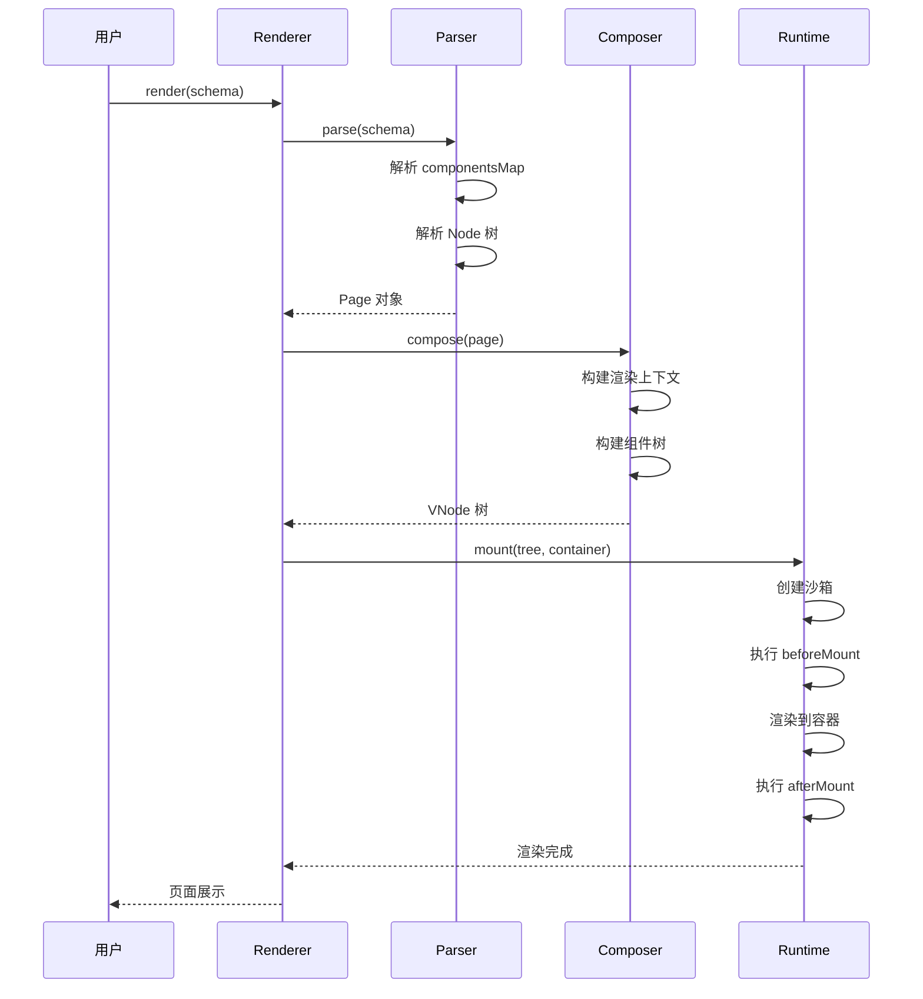

# 渲染器架构

本章节深入解析 Lowcode Engine 渲染器核心 (`@alilc/lowcode-renderer-core`) 的架构设计和实现原理。

## 🎯 渲染器职责

渲染器负责将 **Schema（页面描述协议）** 转换为 **可运行的页面**。

### 核心能力

- 📦 **Schema 解析** - 解析页面 Schema 为可渲染的数据结构
- 🧩 **组件渲染** - 根据组件描述渲染实际组件
- ⚡ **生命周期管理** - 管理组件和页面的生命周期
- 🔌 **插件扩展** - 支持渲染器插件扩展
- 🎭 **运行时沙箱** - 隔离的运行时环境

## 📁 模块结构

```
packages/renderer-core/src/
├── renderer/                # 渲染器核心
│   ├── index.ts            # 入口文件
│   ├── renderer.ts         # 渲染器主类
│   ├── types.ts            # 类型定义
│   └── utils.ts            # 工具函数
├──-parser/                  # 解析层
│   ├── page-parser.ts      # 页面解析器
│   ├── component-parser.ts # 组件解析器
│   └── schema-parser.ts    # Schema 解析器
├── runtime/                 # 运行时
│   ├── runtime.ts          # 运行时核心
│   ├── lifecycle.ts        # 生命周期管理
│   ├── event.ts            # 事件系统
│   └── sandbox.ts          # 沙箱环境
├── composer/                # 组装层
│   ├── composer.ts         # 组件组装
│   ├── tree-builder.ts     # 组件树构建
│   └── renderer-context.ts # 渲染上下文
└── plugins/                 # 插件系统
    ├── plugin-manager.ts   # 插件管理器
    └── builtin-plugins/    # 内置插件
```

## 🏗️ 核心架构

```
┌────────────────────────────────────────────────────────────┐
│                      Renderer Core                          │
├────────────────────────────────────────────────────────────┤
│  ┌─────────────┐  ┌─────────────┐  ┌─────────────┐         │
│  │   Parser    │  │   Composer  │  │   Runtime   │         │
│  │   解析层    │──▶│   组装层    │──▶│   运行时    │         │
│  └─────────────┘  └─────────────┘  └─────────────┘         │
│         ▲                  ▲                  ▲              │
│         │                  │                  │              │
│  ┌──────┴────────┐ ┌──────┴────────┐ ┌──────┴────────┐     │
│  │ Schema Parser  │ │ Tree Builder  │ │ Lifecycle     │     │
│  │ Component Meta │ │ Plugin System │ │ Event System  │     │
│  └───────────────┘ └───────────────┘ └───────────────┘     │
└────────────────────────────────────────────────────────────┘
```

## 🔧 核心类

### 1. Renderer - 渲染器主类

```typescript
// packages/renderer-core/src/renderer/renderer.ts
import { PageParser } from '../parser/page-parser';
import { Composer } from '../composer/composer';
import { Runtime } from '../runtime/runtime';

export class Renderer {
  // 核心组件
  parser: PageParser;
  composer: Composer;
  runtime: Runtime;
  
  // 渲染容器
  container: HTMLElement;
  
  // 渲染状态
  @observable isRendering: boolean = false;
  @observable error: Error | null = null;
  
  async render(schema: IPublicModelDocumentSchema): Promise<void> {
    this.isRendering = true;
    try {
      // 1. 解析 Schema
      const page = await this.parser.parse(schema);
      
      // 2. 组装组件树
      const componentTree = await this.composer.compose(page);
      
      // 3. 挂载到容器
      await this.runtime.mount(componentTree, this.container);
      
    } catch (err) {
      this.error = err;
      throw err;
    } finally {
      this.isRendering = false;
    }
  }
  
  dispose(): void {
    this.runtime.unmount();
    this.composer.dispose();
    this.parser.dispose();
  }
}
```

### 2. PageParser - 页面解析器

```typescript
// packages/renderer-core/src/parser/page-parser.ts
export class PageParser {
  // 解析页面 Schema
  async parse(schema: IPublicModelDocumentSchema): Promise<Page> {
    const page = new Page();
    
    // 解析组件映射表
    page.componentsMap = await this.parseComponentsMap(
      schema.componentsMap
    );
    
    // 解析页面根节点
    if (schema.root) {
      page.root = await this.parseNode(schema.root);
    }
    
    // 解析配置
    page.config = schema.config || {};
    page.lifeCycles = schema.lifeCycles || {};
    
    return page;
  }
  
  // 解析组件映射表
  private async parseComponentsMap(
    map: ComponentMeta[]
  ): Promise<Map<string, ComponentMeta>> {
    const result = new Map<string, ComponentMeta>();
    
    for (const meta of map) {
      // 加载组件
      const component = await this.loadComponent(meta);
      result.set(component.componentName, component);
    }
    
    return result;
  }
  
  // 解析节点
  private async parseNode(nodeSchema: any): Promise<Node> {
    const node = new Node();
    node.componentName = nodeSchema.componentName;
    node.props = nodeSchema.props || {};
    node.children = [];
    
    // 递归解析子节点
    if (nodeSchema.children) {
      for (const childSchema of nodeSchema.children) {
        const child = await this.parseNode(childSchema);
        node.children.push(child);
      }
    }
    
    return node;
  }
  
  // 加载组件
  private async loadComponent(meta: ComponentMeta): Promise<Component> {
    const { componentName, package: pkg, exportName } = meta;
    
    // 从 CDN 或本地加载
    if (pkg) {
      return await this.loadFromCDN(pkg, exportName);
    }
    
    // 从全局注册表获取
    return this.getFromRegistry(componentName);
  }
}
```

### 3. Composer - 组装器

```typescript
// packages/renderer-core/src/composer/composer.ts
export class Composer {
  // 组装组件树
  async compose(page: Page): Promise<VNode> {
    // 1. 构建渲染上下文
    const context = this.createContext(page);
    
    // 2. 构建组件树
    const tree = await this.buildTree(page.root, context);
    
    // 3. 处理生命周期
    this.setupLifecycle(page, context);
    
    return tree;
  }
  
  // 构建组件树
  private async buildTree(
    node: Node, 
    context: RenderContext
  ): Promise<VNode> {
    // 获取组件
    const component = await this.getComponent(node.componentName);
    
    // 处理 Props
    const props = await this.parseProps(node.props, context);
    
    // 创建 VNode
    const vnode = {
      type: component,
      props,
      key: node.id,
      children: []
    };
    
    // 递归构建子节点
    if (node.children) {
      for (const child of node.children) {
        const childVNode = await this.buildTree(child, context);
        vnode.children.push(childVNode);
      }
    }
    
    return vnode;
  }
  
  // 解析 Props
  private async parseProps(
    props: any, 
    context: RenderContext
  ): Promise<any> {
    const result: any = {};
    
    for (const [key, value] of Object.entries(props)) {
      // 处理绑定表达式
      if (this.isBindingExpression(value)) {
        result[key] = await this.evalBinding(value, context);
      } else {
        result[key] = value;
      }
    }
    
    return result;
  }
}
```

### 4. Runtime - 运行时

```typescript
// packages/renderer-core/src/runtime/runtime.ts
export class Runtime {
  // 沙箱环境
  sandbox: Sandbox;
  
  // 生命周期管理
  lifecycle: LifecycleManager;
  
  // 事件系统
  eventBus: EventBus;
  
  // 挂载组件
  async mount(tree: VNode, container: HTMLElement): Promise<void> {
    // 创建沙箱
    this.sandbox = new Sandbox();
    
    // 执行生命周期
    await this.lifecycle.emit('beforeMount');
    
    // 渲染到容器
    await this.renderToContainer(tree, container);
    
    // 执行生命周期
    await this.lifecycle.emit('afterMount');
  }
  
  // 卸载
  async unmount(): Promise<void> {
    await this.lifecycle.emit('beforeUnmount');
    this.sandbox.destroy();
    this.eventBus.clear();
  }
  
  // 渲染到容器
  private async renderToContainer(
    tree: VNode, 
    container: HTMLElement
  ): Promise<void> {
    // 使用 React/Vue 等框架渲染
    // 这里可能是 React DOM.render
    // 或自定义渲染逻辑
  }
}
```

## 🔄 渲染流程



## 📋 Schema 协议

### 页面 Schema 结构

```typescript
interface IPublicModelDocumentSchema {
  // 页面根节点
  root: IPublicModelNodeSchema;
  
  // 组件映射表
  componentsMap: ComponentMeta[];
  
  // 生命周期
  lifeCycles?: {
    componentDidMount?: string;
    componentWillUnmount?: string;
  };
  
  // 配置
  config?: {
    device?: 'Mobile' | 'PC';
    css?: string;
  };
  
  // 国际化
  i18n?: Record<string, any>;
}
```

### 节点 Schema 结构

```typescript
interface IPublicModelNodeSchema {
  // 组件名
  componentName: string;
  
  // 属性
  props?: Record<string, any>;
  
  // 子节点
  children?: IPublicModelNodeSchema[];
  
  // 节点 ID
  id?: string;
  
  // 是否隐藏
  hidden?: boolean;
  
  // 是否锁定
  isLocked?: boolean;
  
  // 条件渲染
  condition?: boolean | string;
  
  // 循环渲染
  loop?: any[];
  loopArgs?: string[];
  
  // 样式
  style?: Record<string, any>;
}
```

## 🎭 运行时沙箱

```typescript
// packages/renderer-core/src/runtime/sandbox.ts
export class Sandbox {
  // 隔离的 window 对象
  sandboxWindow: Window;
  
  // 隔离的 document 对象
  sandboxDocument: Document;
  
  constructor() {
    // 创建 iframe 沙箱
    const iframe = document.createElement('iframe');
    iframe.style.display = 'none';
    document.body.appendChild(iframe);
    
    this.sandboxWindow = iframe.contentWindow!;
    this.sandboxDocument = iframe.contentDocument!;
  }
  
  // 执行代码
  eval(code: string, context: any): any {
    const fn = new Function('context', `
      with (context) {
        return (${code});
      }
    `);
    return fn(context);
  }
  
  // 销毁沙箱
  destroy(): void {
    const iframe = this.sandboxWindow.frameElement;
    if (iframe) {
      iframe.parentNode?.removeChild(iframe);
    }
  }
}
```

## 🎯 生命周期管理

```typescript
// packages/renderer-core/src/runtime/lifecycle.ts
export class LifecycleManager {
  private hooks: Map<string, Function[]> = new Map();
  
  // 注册生命周期钩子
  on(lifecycle: string, hook: Function): void {
    if (!this.hooks.has(lifecycle)) {
      this.hooks.set(lifecycle, []);
    }
    this.hooks.get(lifecycle)!.push(hook);
  }
  
  // 触发生命周期
  async emit(lifecycle: string, context?: any): Promise<void> {
    const hooks = this.hooks.get(lifecycle) || [];
    
    for (const hook of hooks) {
      await hook(context);
    }
  }
  
  // 渲染生命周期
  emitRenderLifecycle(context: any): void {
    this.emit('beforeMount', context);
    this.emit('afterMount', context);
    this.emit('beforeUpdate', context);
    this.emit('afterUpdate', context);
    this.emit('beforeUnmount', context);
  }
}
```

##RICS 渲染优化

### 1. 懒加载

```typescript
// 按需加载组件
async loadComponent(componentName: string): Promise<Component> {
  // 检查是否已加载
  if (this.registry.has(componentName)) {
    return this.registry.get(componentName)!;
  }
  
  // 动态导入
  const module = await import(`@/components/${componentName}`);
  const component = module.default;
  
  // 注册到缓存
  this.registry.set(componentName, component);
  
  return component;
}
```

### 2. 虚拟节点复用

```typescript
// VNode 复用
function shouldReuseVNode(prevVNode: VNode, nextVNode: VNode): boolean {
  return (
    prevVNode.type === nextVNode.type &&
    prevVNode.key === nextVNode.key
  );
}
```

### 3. 增量渲染

```typescript
// 只渲染变化的部分
async incrementalRender(diff: DiffResult): Promise<void> {
  for (const update of diff.updates) {
    await this.applyUpdate(update);
  }
}
```

## 📊 渲染器类型

### 1. React Renderer

```typescript
// packages/react-renderer/src/index.ts
import ReactDOM from 'react-dom';

export class ReactRenderer implements IRenderer {
  async mount(tree: VNode, container: HTMLElement): Promise<void> {
    ReactDOM.render(tree, container);
  }
  
  async unmount(container: HTMLElement): Promise<void> {
    ReactDOM.unmountComponentAtNode(container);
  }
}
```

### 2. 小程序 Renderer

```typescript
// 自定义小程序渲染器
export class MiniAppRenderer implements IRenderer {
  async mount(tree: VNode, context: MiniAppContext): Promise<void> {
    // 转换为小程序模板
    const template = this.convertToTemplate(tree);
    // 渲染到小程序
    context.render(template);
  }
}
```

## 📖 下一步

- 阅读 [引擎核心](/core/engine-core) 深入实现细节
- 阅读 [设计器](/core/designer) 了解设计器源码
- 阅读 [自定义渲染器](/advanced/custom-renderer) 开发自定义渲染器

---

上一篇：[编辑器核心](/architecture/editor-core) · 下一篇：[引擎核心](/core/engine-core)