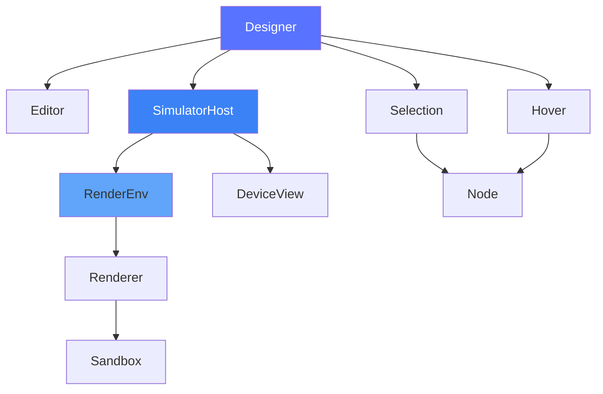

# 设计器

本章节深入解析 `@alilc/lowcode-designer` 设计器模块的源码实现。

## 🎯 模块职责

设计器是 Lowcode Engine 可视化设计的核心模块，负责：

- 🎨 **可视化编辑** - 提供所见即所得的设计体验
- 🖱️ **交互管理** - 拖拽、选择、悬停等交互
- 🎭 **模拟器** - 提供页面预览的沙箱环境
- 📋 **骨架层集成** - 与 UI 框架集成

## 📁 源码结构

```
packages/designer/src/
├── index.ts                     # 统一入口
├── designer/                    # 设计器核心
│   ├── designer.ts             # 设计器主类
│   ├── selection.ts            # 选择管理
│   ├── hover.ts                # 悬停管理
│   ├── prop.ts                 # 属性管理
│   └── setting.ts              # 设置管理
├── simulator/                   # 模拟器
│   ├── simulator-host.ts       # 模拟器宿主
│   ├── render-env.ts           # 渲染环境
│   └── device-view.ts          # 设备视图
├── editor/                      # 编辑器视图
│   ├── editor-view.ts          # 编辑器视图
│   └── workbench.ts            # 工作台
└── skeleton/                    # 骨架层集成
    └── skeleton.ts             # 骨架配置
```

## 🔧 核心类

### 1. Designer - 设计器主类

```typescript
// packages/designer/src/designer/designer.ts
import { Editor, Project, DocumentModel } from '@alilc/lowcode-editor-core';
import { SimulatorHost } from '../simulator/simulator-host';
import { ISelection } from './selection';
import { IHover } from './hover';

export class Designer {
  // 编辑器实例
  editor: Editor;
  
  // 当前项目
  project: Project | null = null;
  
  // 模拟器宿主
  simulatorHost: SimulatorHost;
  
  // 选择管理
  selection: ISelection;
  
  // 悬停管理
  hover: IHover;
  
  // 骨架层
  skeleton: Skeleton;
  
  constructor(editor: Editor) {
    this.editor = editor;
    this.selection = new Selection(this);
    this.hover = new Hover(this);
    this.simulatorHost = new SimulatorHost(this);
  }
  
  // 初始化
  async init(project: Project): Promise<void> {
    this.project = project;
    
    // 初始化模拟器
    await this.simulatorHost.init();
    
    // 设置选择监听
    this.setupSelectionListener();
    
    // 暴露全局实例
    (window as any).designer = this;
  }
  
  // 获取当前文档
  get currentDocument(): DocumentModel | null {
    return this.project?.currentDocument || null;
  }
  
  // 选中节点
  selectNode(node: Node): void {
    this.selection.select(node);
  }
}
```

### 2. Selection - 选择管理

```typescript
// packages/designer/src/designer/selection.ts
import { action, observable, computed } from 'mobx';
import { Node } from '@alilc/lowcode-editor-core';

export class Selection {
  designer: Designer;
  
  @observable private selected: Node | null = null;
  @observable private selectedIds: string[] = [];
  
  constructor(designer: Designer) {
    this.designer = designer;
  }
  
  // 获取选中节点
  @computed
  get node(): Node | null {
    return this.selected;
  }
  
  // 获取选中节点 ID
  @computed
  get nodeIds(): string[] {
    return this.selectedIds;
  }
  
  // 选择单个节点
  @action
  select(node: Node | null): void {
    if (this.selected === node) return;
    
    // 取消之前选中
    if (this.selected) {
      this.selected.emit('unselect');
    }
    
    this.selected = node;
    this.selectedIds = node ? [node.id] : [];
    
    // 触发选中事件
    if (node) {
      node.emit('select');
      this.designer.editor.emit('node:select', { node });
    }
    
    // 更新属性面板
    this.updatePropPanel();
  }
  
  // 清除选中
  @action
  clear(): void {
    this.select(null);
  }
  
  // 更新属性面板
  private updatePropPanel(): void {
    const propPanel = this.designer.skeleton.propPanel;
    if (propPanel && this.selected) {
      propPanel.setProps(this.selected.props);
    }
  }
}
```

### 3. SimulatorHost - 模拟器宿主

```typescript
// packages/designer/src/simulator/simulator-host.ts
import { action, observable } from 'mobx';
import { RenderEnv } from './render-env';
import { DeviceView } from './device-view';

export class SimulatorHost {
  designer: Designer;
  
  @observable renderEnv: RenderEnv | null = null;
  @observable deviceView: DeviceView | null = null;
  
  // 设备类型
  @observable device: 'PC' | ' Tablet' | 'Mobile' = 'PC';
  
  // 缩放比例
  @observable scale: number = 1;
  
  constructor(designer: Designer) {
    this.designer = designer;
  }
  
  // 初始化
  async init(): Promise<void> {
    // 创建渲染环境
    this.renderEnv = new RenderEnv(this);
    await this.renderEnv.init();
    
    // 创建设备视图
    this.deviceView = new DeviceView(this);
  }
  
  // 设置设备类型
  @action
  setDevice(device: 'PC' | 'Tablet' | 'Mobile'): void {
    this.device = device;
    this.deviceView?.updateDevice(device);
  }
  
  // 设置缩放
  @action
  setScale(scale: number): void {
    this.scale = scale;
    this.deviceView?.updateScale(scale);
  }
  
  // 获取渲染容器
  getRenderContainer(): HTMLElement | null {
    return this.renderEnv?.container || null;
  }
}
```

### 4. RenderEnv - 渲染环境

```typescript
// packages/designer/src/simulator/render-env.ts
import { Renderer } from '@alilc/lowcode-renderer-core';

export class RenderEnv {
  host: SimulatorHost;
  renderer: Renderer | null = null;
  container: HTMLElement | null = null;
  
  constructor(host: SimulatorHost) {
    this.host = host;
  }
  
  // 初始化渲染环境
  async init(): Promise<void> {
    // 创建沙箱容器
    this.container = this.createSandboxContainer();
    
    // 创建渲染器
    this.renderer = new Renderer();
    
    // 初始化渲染器
    await this.renderer.init({
      container: this.container,
      device: this.host.device
    });
  }
  
  // 创建沙箱容器
  private createSandboxContainer(): HTMLElement {
    const container = document.createElement('div');
    container.className = 'lowcode-simulator-container';
    container.style.width = '100%';
    container.style.height = '100%';
    return container;
  }
  
  // 渲染页面
  async render(schema: any): Promise<void> {
    if (this.renderer) {
      await this.renderer.render(schema);
    }
  }
  
  // 销毁
  destroy(): void {
    this.renderer?.dispose();
    this.container?.remove();
  }
}
```

## 🎨 交互管理

### 拖拽系统

```typescript
// packages/designer/src/dnd/drag-handler.ts
export class DragHandler {
  private dragNode: Node | null = null;
  private dropTarget: Node | null = null;
  
  // 开始拖拽
  onStart(node: Node, event: MouseEvent): void {
    this.dragNode = node;
    
    // 创建拖拽预览
    this.createDragPreview(node);
    
    // 绑定移动和结束事件
    document.addEventListener('mousemove', this.onMove);
    document.addEventListener('mouseup', this.onEnd);
  }
  
  // 拖拽中
  onMove = (event: MouseEvent): void => {
    // 更新预览位置
    this.updatePreviewPosition(event);
    
    // 检测放置目标
    this.dropTarget = this.detectDropTarget(event);
    
    // 显示放置指示器
    this.showDropIndicator(this.dropTarget);
  };
  
  // 结束拖拽
  onEnd = (event: MouseEvent): void => {
    if (this.dragNode && this.dropTarget) {
      // 执行放置
      this.executeDrop(this.dragNode, this.dropTarget);
    }
    
    // 清理
    this.removeDragPreview();
    this.removeDropIndicator();
    
    document.removeEventListener('mousemove', this.onMove);
    document.removeEventListener('mouseup', this.onEnd);
  };
  
  // 执行放置
  private executeDrop(dragNode: Node, dropTarget: Node): void {
    const document = dragNode.document;
    
    // 从原位置移除
    dragNode.remove();
    
    // 添加到目标位置
    dropTarget.appendChild(dragNode);
    
    // 触发事件
    document.emit('node:drop', {
      node: dragNode,
      target: dropTarget
    });
  }
}
```

### 悬停系统

```typescript
// packages/designer/src/designer/hover.ts
import { action, observable } from 'mobx';

export class Hover {
  designer: Designer;
  
  @observable private hoveredNode: Node | null = null;
  
  constructor(designer: Designer) {
    this.designer = designer;
  }
  
  // 获取悬停节点
  get node(): Node | null {
    return this.hoveredNode;
  }
  
  // 设置悬停
  @action
  setHover(node: Node | null): void {
    // 取消之前悬停
    if (this.hoveredNode) {
      this.hoveredNode.emit('unhover');
    }
    
    this.hoveredNode = node;
    
    // 触发悬停事件
    if (node) {
      node.emit('hover');
    }
  }
  
  // 清除悬停
  @action
  clearHover(): void {
    this.setHover(null);
  }
}
```

## 🖼️ 设备视图

```typescript
// packages/designer/src/simulator/device-view.ts
export class DeviceView {
  host: SimulatorHost;
  
  // 设备预设
  private devices = {
    PC: { width: 1440, height: 900 },
    Tablet: { width: 768, height: 1024 },
    Mobile: { width: 375, height: 667 }
  };
  
  constructor(host: SimulatorHost) {
    this.host = host;
  }
  
  // 更新设备
  updateDevice(device: 'PC' | 'Tablet' | 'Mobile'): void {
    const size = this.devices[device];
    const container = this.host.getRenderContainer();
    
    if (container) {
      container.style.width = `${size.width}px`;
      container.style.height = `${size.height}px`;
    }
  }
  
  // 更新缩放
  updateScale(scale: number): void {
    const container = this.host.getRenderContainer();
    
    if (container) {
      container.style.transform = `scale(${scale})`;
    }
  }
}
```

## 📊 设计器架构



## 🎯 使用示例

### 访问设计器实例

```typescript
// 通过 editor 访问
const designer = editor.designer;

// 访问选择
const selectedNode = designer.selection.node;

// 访问模拟器
const simulator = designer.simulatorHost;

// 切换设备
simulator.setDevice('Mobile');

// 设置缩放
simulator.setScale(0.8);
```

### 监听选择事件

```typescript
designer.selection.subscribe((selectedNode) => {
  console.log('选中节点变更:', selectedNode);
});
```

### 自定义拖拽行为

```typescript
// 注册自定义拖拽处理器
designer.dnd.registerHandler({
  canDrag(node) {
    return node.componentName !== 'FixedComponent';
  },
  
  canDrop(dragNode, dropTarget) {
    return dropTarget.acceptsChild(dragNode);
  },
  
  onDrop(dragNode, dropTarget, position) {
    // 自定义放置逻辑
  }
});
```

## 📖 下一步

- 阅读 [骨架层](/core/skeleton) 了解 UI 框架
- 阅读 [工作区](/core/workspace) 了解工作区管理
- 阅读 [插件系统](/core/plugin-system) 了解插件架构

---

上一篇：[引擎核心](/core/engine-core) · 下一篇：[骨架层](/core/skeleton)