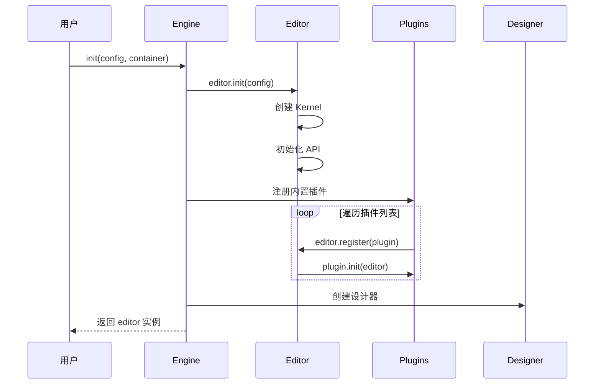

# 引擎核心

本章节深入解析 `@alilc/lowcode-engine` 引擎核心模块的源码实现。

## 🎯 模块定位

`@alilc/lowcode-engine` 是整个 Lowcode Engine 的**统一入口**，负责：

- 🚀 **引擎初始化** - 提供统一的初始化接口
- 🔌 **插件管理** - 注册和管理所有插件
- 📦 **模块导出** - 整合所有子模块的 API
- ⚙️ **默认配置** - 提供开箱即用的默认配置

## 📁 源码结构

```
packages/engine/src/
├── index.ts                      # 统一入口
├── engine-core.ts                # 引擎核心类
├── editor-context.ts             # 编辑器上下文
├── builtin-plugins/              # 内置插件
│   ├── index.ts
│   ├── plugin-history.ts        # 历史记录插件
│   ├── plugin-selection.ts      # 选择插件
│   └── plugin-canvas.ts         # 画布插件
└── utils/
    └── config.ts                # 配置工具
```

## 🔧 核心源码

### 1. 统一入口 (index.ts)

```typescript
// packages/engine/src/index.ts
import './global-integrity';

// 导出核心模块
export * from '@alilc/lowcode-editor-core';
export * from '@alilc/lowcode-designer';
export * from '@alilc/lowcode-editor-skeleton';
export * from '@alilc/lowcode-plugin-command';
export * from '@alilc/lowcode-plugin-designer';
export * from '@alilc/lowcode-plugin-outline-pane';
export * from '@alilc/lowcode-workspace';

// 导出默认插件
export { default as BuiltInPlugins } from './builtin-plugins';

// 导出引擎核心
export { init, Engine } from './engine-core';

// 导出类型
export * from '@alilc/lowcode-types';
```

### 2. 引擎核心类 (engine-core.ts)

```typescript
// packages/engine/src/engine-core.ts
import { Editor, IPublicModelEngineConfig } from '@alilc/lowcode-editor-core';
import { Designer } from '@alilc/lowcode-designer';
import { Skeleton } from '@alilc/lowcode-editor-skeleton';
import { Workspace } from '@alilc/lowcode-workspace';
import BuiltInPlugins from './builtin-plugins';

const editor = new Editor();

/**
 * 引擎初始化函数
 * @param config - 引擎配置
 * @param container - 容器元素
 */
export async function init(
  config: IPublicModelEngineConfig,
  container?: HTMLElement
): Promise<Editor> {
  // 1. 初始化编辑器
  await editor.init(config);
  
  // 2. 注册内置插件
  await registerBuiltInPlugins(editor);
  
  // 3. 设置容器
  if (container) {
    setupContainer(container);
  }
  
  // 4. 启动引擎
  await startEngine(editor, config);
  
  return editor;
}

/**
 * 注册内置插件
 */
async function registerBuiltInPlugins(editor: Editor): Promise<void> {
  // 注册默认插件
  for (const plugin of BuiltInPlugins) {
    await editor.register(plugin);
  }
}

/**
 * 设置容器
 */
function setupContainer(container: HTMLElement): void {
  container.id = 'lowcode-engine-container';
  container.style.height = '100%';
  container.style.width = '100%';
}

/**
 * 启动引擎
 */
async function startEngine(
  editor: Editor, 
  config: IPublicModelEngineConfig
): Promise<void> {
  // 创建项目
  if (config.schema) {
    await editor.createProject(config.schema);
  }
  
  // 暴露全局实例
  (window as any).editor = editor;
}
```

### 3. 编辑器上下文 (editor-context.ts)

```typescript
// packages/engine/src/editor-context.ts
import { Editor, Kernel, Project } from '@alilc/lowcode-editor-core';

/**
 * 编辑器上下文类
 * 提供编辑器运行时的上下文环境
 */
export class EditorContext {
  // 编辑器实例
  private editor: Editor;
  
  // 内核实例
  private kernel: Kernel;
  
  // 当前项目
  private project: Project | null = null;
  
  constructor(editor: Editor) {
    this.editor = editor;
    this.kernel = editor.kernel;
  }
  
  // 获取项目
  getProject(): Project | null {
    return this.project || this.editor.project;
  }
  
  // 设置项目
  setProject(project: Project): void {
    this.project = project;
  }
  
  // 获取内核配置
  getKernelConfig(): any {
    return this.kernel.config;
  }
  
  // 销毁上下文
  destroy(): void {
    this.project = null;
  }
}
```

### 4. 内置插件管理

```typescript
// packages/engine/src/builtin-plugins/index.ts
import historyPlugin from './plugin-history';
import selectionPlugin from './plugin-selection';
import canvasPlugin from './plugin-canvas';
import materialPlugin from './plugin-material';

/**
 * 内置插件列表
 */
const BuiltInPlugins = [
  historyPlugin,      // 历史记录插件
  selectionPlugin,    // 选择管理插件
  canvasPlugin,       // 画布管理插件
  materialPlugin,     // 物料管理插件
];

export default BuiltInPlugins;
```

### 5. 历史记录插件示例

```typescript
// packages/engine/src/builtin-plugins/plugin-history.ts
import { IPublicTypePluginMeta, IPublicModelEditor } from '@alilc/lowcode-types';

const historyPlugin = (editor: IPublicModelEditor) => {
  return {
    // 插件名称
    name: 'builtin-history',
    
    // 插件导出
    exportName: 'HistoryPlugin',
    
    // 初始化
    async init() {
      const { history } = editor;
      
      // 注册快捷键
      editor.registerShortcut({
        name: 'undo',
        handler: () => history.undo(),
        key: 'ctrl+z'
      });
      
      editor.registerShortcut({
        name: 'redo',
        handler: () => history.redo(),
        key: 'ctrl+shift+z'
      });
      
      // 监听变化
      editor.on('document:change', () => {
        history.record();
      });
    },
    
    // 销毁
    destroy() {
      // 清理资源
    }
  } as IPublicTypePluginMeta;
};

export default historyPlugin;
```

## 🏗️ 初始化流程



## 📦 依赖关系

```typescript
// 引擎依赖的核心包
dependencies: {
  // 编辑器核心
  "@alilc/lowcode-editor-core": "1.3.2",
  
  // 设计器
  "@alilc/lowcode-designer": "1.3.2",
  
  // 骨架层
  "@alilc/lowcode-editor-skeleton": "1.3.2",
  
  // 插件
  "@alilc/lowcode-plugin-command": "1.3.2",
  "@alilc/lowcode-plugin-designer": "1.3.2",
  "@alilc/lowcode-plugin-outline-pane": "1.3.2",
  
  // 工作区
  "@alilc/lowcode-workspace": "1.3.2",
  
  // 工具
  "@alilc/lowcode-utils": "1.3.2",
  "@alilc/lowcode-shell": "1.3.2",
  
  // 渲染器
  "@alilc/lowcode-renderer-core": "1.3.2",
  "@alilc/lowcode-react-simulator-renderer": "1.3.2",
  
  // UI 依赖
  "@alifd/next": "^1.19.12",
  "react": "^16.8.1",
  "react-dom": "^16.8.1"
}
```

## 🎯 使用示例

### 基础使用

```typescript
import { init } from '@alilc/lowcode-engine';

async function setup() {
  const container = document.getElementById('lce-container');
  
  const editor = await init({
    // 页面 Schema
    schema: {
      componentName: 'Page',
      props: {},
      children: []
    },
    
    // 配置选项
    locale: 'zh-CN',
    enableCondition: true,
    enableCanvasLock: true,
    enableLayoutComponent: true,
    enableDeviceSwitcher: true,
    
    // 行为配置
    behavior: {
      dnd: true,
      dropAsFirstChild: false
    }
  }, container);
  
  return editor;
}
```

### 注册自定义插件

```typescript
import { init } from '@alilc/lowcode-engine';

const customPlugin = {
  name: 'my-custom-plugin',
  exportName: 'MyCustomPlugin',
  async init(editor) {
    console.log('插件初始化', editor);
    
    // 添加自定义 API
    editor.customApi = {
      doSomething: () => {
        console.log('执行操作');
      }
    };
  }
};

const editor = await init({
  schema: pageSchema,
  plugins: [customPlugin]
}, container);
```

### 监听事件

```typescript
const editor = await init(config, container);

// 监听节点选择
editor.on('node:select', (node) => {
  console.log('选中节点:', node);
});

// 监听属性变化
editor.on('node:prop:change', ({ nodeId, propKey, newValue }) => {
  console.log('属性变化:', nodeId, propKey, newValue);
});

// 监听文档变化
editor.on('document:change', (change) => {
  console.log('文档变化:', change);
});
```

## 🔌 插件 API

### 插件接口定义

```typescript
interface IPublicTypePluginMeta {
  // 插件名称
  name: string;
  
  // 插件导出名
  exportName: string;
  
  // 插件依赖
  dependsOn?: string[];
  
  // 初始化方法
  init(editor: IPublicModelEditor, options?: any): void | Promise<void>;
  
  // 销毁方法
  destroy?(): void;
  
  // 插件优先级
  priority?: number;
}
```

### 注册插件

```typescript
// 方式 1：初始化时注册
const editor = await init({
  schema,
  plugins: [plugin1, plugin2]
}, container);

// 方式 2：动态注册
await editor.register(plugin);

// 方式 3：批量注册
await editor.register([plugin1, plugin2, plugin3]);
```

## 📊 核心 API

### 全局 API

| API | 说明 |
|-----|------|
| `editor.project` | 当前项目 |
| `editor.currentDocument` | 当前文档 |
| `editor.selection` | 选择管理 |
| `editor.history` | 历史记录 |
| `editor.materials` | 物料管理 |
| `editor.plugins` | 插件管理 |
| `editor.setting` | 设置管理 |
| `editor.canvas` | 画布管理 |

### 文档 API

| API | 说明 |
|-----|------|
| `document.getNode(id)` | 获取节点 |
| `document.selectNode(node)` | 选择节点 |
| `document.createNewNode(schema)` | 创建节点 |
| `document.import(schema)` | 导入 Schema |
| `document.export()` | 导出 Schema |

### 节点 API

| API | 说明 |
|-----|------|
| `node.appendChild(child)` | 添加子节点 |
| `node.insertBefore(child)` | 插入节点 |
| `node.remove()` | 移除节点 |
| `node.serialize()` | 序列化节点 |
| `node.setOnset(key, value)` | 设置属性 |

## 📖 下一步

- 阅读 [设计器](/core/designer) 了解设计器源码
- 阅读 [骨架层](/core/skeleton) 了解骨架层设计
- 阅读 [插件系统](/core/plugin-system) 了解插件架构

---

上一篇：[渲染器架构](/architecture/renderer) · 下一篇：[设计器](/core/designer)