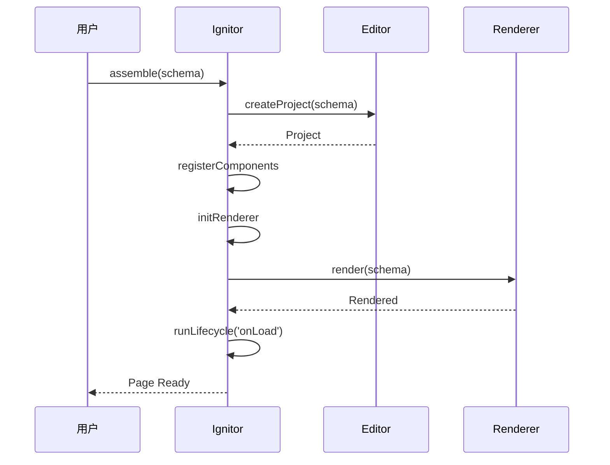

# 页面组装器

本章节解析 `@alilc/lowcode-ignitor` 页面组装器的源码实现。

## 🎯 模块职责

页面组装器负责**页面的初始化和组装流程**：

- 📦 **Schema 加载** - 加载页面 Schema
- 🔧 **组件注册** - 注册组件和物料
- 🚀 **页面渲染** - 启动页面渲染
- 🎭 **生命周期** - 管理页面生命周期

## 🔧 核心实现

### 1. 页面组装器主类

```typescript
// packages/ignitor/src/ignitor.ts
export class Ignitor {
  editor: Editor;
  schema: IPublicModelProjectSchema;
  
  constructor(editor: Editor) {
    this.editor = editor;
  }
  
  // 组装页面
  async assemble(schema: IPublicModelProjectSchema): Promise<void> {
    // 1. 创建项目
    const project = await this.editor.createProject(schema);
    
    // 2. 注册组件
    await this.registerComponents(schema.componentsMap);
    
    // 3. 初始化渲染
    await this.initRenderer();
    
    // 4. 执行生命周期
    await this.runLifecycle('onLoad');
  }
  
  // 注册组件
  private async registerComponents(
    componentsMap: ComponentMeta[]
  ): Promise<void> {
    for (const meta of componentsMap) {
      const component = await this.loadComponent(meta);
      this.editor.materials.register(component);
    }
  }
  
  // 初始化渲染器
  private async initRenderer(): Promise<void> {
    const renderer = this.editor.getRenderer();
    const currentDoc = this.editor.currentDocument;
    
    if (renderer && currentDoc) {
      await renderer.render(currentDoc.export());
    }
  }
  
  // 执行生命周期
  private async runLifecycle(
    lifecycle: string
  ): Promise<void> {
    const currentDoc = this.editor.currentDocument;
    const lifeCycles = currentDoc?.lifeCycles || {};
    
    const handler = lifeCycles[lifecycle];
    if (handler) {
      await handler();
    }
  }
}
```

### 2. 使用示例

```typescript
import { init } from '@alilc/lowcode-engine';
import { Ignitor } from '@alilc/lowcode-ignitor';

// 初始化引擎
const editor = await init({
  schema: pageSchema
}, container);

// 创建组装器
const ignitor = new Ignitor(editor);

// 组装页面
await ignitor.assemble(pageSchema);
```

## 📊 组装流程



## 📖 下一步

- 阅读 [进阶篇概览](/advanced/overview) 了解进阶开发指南

---

上一篇：[命令插件](/core/plugin-command) · 下一篇：[进阶篇概览](/advanced/overview)