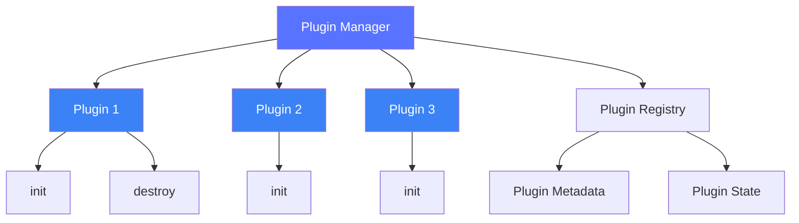

# 插件系统

本章节深入解析 Lowcode Engine 的插件系统架构。

## 🎯 插件系统概述

Lowcode Engine 采用**完全插件化**的架构设计，所有核心功能都通过插件实现。

### 核心特性

- 🔌 **插件化架构** - 所有功能都是插件
- 📦 **按需加载** - 支持插件懒加载
- ⚡ **热插拔** - 动态注册和卸载插件
- 🎛️ **优先级控制** - 插件执行顺序可控

## 📁 核心结构

```
packages/plugin-command/src/
├── index.ts                     # 插件入口
├── command-plugin.ts            # 命令插件实现
└── commands/                    # 命令列表
    ├── undo-command.ts
    ├── redo-command.ts
    ├── delete-command.ts
    └── ...
```

## 🔧 插件接口

```typescript
interface IPublicTypePluginMeta {
  // 插件名称（唯一）
  name: string;
  
  // 插件导出名
  exportName: string;
  
  // 插件依赖
  dependsOn?: string[];
  
  // 初始化方法
  init(editor: IPublicModelEditor, options?: any): 
    void | Promise<void>;
  
  // 销毁方法
  destroy?(): void;
  
  // 优先级（数字越小优先级越高）
  priority?: number;
}
```

## 📝 开发自定义插件

### 基础插件

```typescript
import { IPublicTypePluginMeta } from '@alilc/lowcode-types';

const myPlugin: IPublicTypePluginMeta = {
  name: 'my-custom-plugin',
  exportName: 'MyCustomPlugin',
  
  async init(editor) {
    console.log('插件初始化');
    
    // 添加自定义 API
    editor.myApi = {
      doSomething: () => {
        console.log('执行操作');
      }
    };
    
    // 监听事件
    editor.on('node:select', (node) => {
      console.log('节点被选中', node);
    });
  },
  
  destroy() {
    console.log('插件销毁');
  }
};

export default myPlugin;
```

### 带配置的插件

```typescript
interface MyPluginOptions {
  apiUrl: string;
  timeout: number;
}

const myPlugin = (options?: MyPluginOptions) => {
  return {
    name: 'my-plugin-with-config',
    exportName: 'MyPluginWithConfig',
    
    async init(editor) {
      const config = {
        apiUrl: options?.apiUrl || '/api',
        timeout: options?.timeout || 5000
      };
      
      console.log('插件配置', config);
    }
  };
};

// 使用
editor.register(myPlugin({
  apiUrl: '/custom-api',
  timeout: 10000
}));
```

## 🎯 注册插件

### 初始化时注册

```typescript
import { init } from '@alilc/lowcode-engine';
import myPlugin from './my-plugin';

const editor = await init({
  schema: pageSchema,
  plugins: [
    myPlugin,
    // 其他插件
  ]
}, container);
```

### 动态注册

```typescript
// 注册单个插件
await editor.register(myPlugin);

// 注册多个插件
await editor.register([plugin1, plugin2, plugin3]);

// 带配置注册
await editor.register(myPlugin({ option: 'value' }));
```

## 📊 插件架构



## 📖 下一步

- 阅读 [物料系统](/core/material) 了解物料管理
- 阅读 [设置器](/core/setters) 了解属性设置器
- 阅读 [自定义插件](/advanced/custom-plugin) 开发自定义插件

---

上一篇：[工作区](/core/workspace) · 下一篇：[物料系统](/core/material)