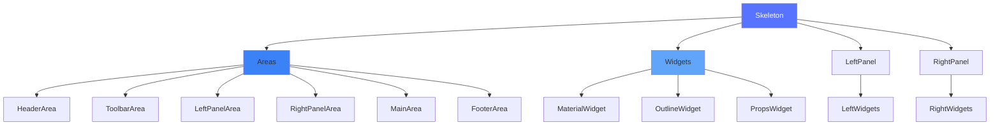

# 骨架层

本章节解析 `@alilc/lowcode-editor-skeleton` 骨架层模块，理解编辑器 UI 架构。

## 🎯 骨架层概念

骨架层（Skeleton）是 Lowcode Engine 的**UI 布局框架**，定义了编辑器的界面结构和组件组织方式。

### 核心作用

- 🏗️ **界面布局** - 定义编辑器的整体布局结构
- 🧩 **组件注册** - 管理界面组件（Widget）的注册和渲染
- 📋 **面板管理** - 管理左右侧面板的显示和隐藏
- 🎨 **样式主题** - 提供主题切换能力

## 📁 源码结构

```
packages/editor-skeleton/src/
├── index.ts                     # 统一入口
├── skeleton/                    # 骨架核心
│   ├── skeleton.ts             # 骨架主类
│   ├── area.ts                 # 区域定义
│   └── config.ts               # 配置管理
├── widget/                      # Widget 组件
│   ├── widget.ts               # Widget 基类
│   ├── panel-widget.ts         # 面板 Widget
│   ├── toolbar-widget.ts       # 工具栏 Widget
│   └── container-widget.ts     # 容器 Widget
├── panel/                       # 面板组件
│   ├── panel.ts                # 面板基类
│   ├── left-panel.ts           # 左侧面板
│   └── right-panel.ts          # 右侧面板
├── components/                  # UI 组件
│   ├── header/                 # 头部组件
│   ├── footer/                 # 底部组件
│   └── canvas/                 # 画布组件
└── themes/                      # 主题
    ├── dark/                   # 深色主题
    └── light/                  # 浅色主题
```

## 🔧 核心类

### 1. Skeleton - 骨架主类

```typescript
// packages/editor-skeleton/src/skeleton/skeleton.ts
import { observable, action } from 'mobx';
import { Widget } from '../widget/widget';
import { Panel } from '../panel/panel';
import { Area } from './area';

export class Skeleton {
  // 编辑器实例
  editor: any;
  
  // 区域管理
  @observable areas: {
    header: Area;
    toolbar: Area;
    leftPanel: Area;
    rightPanel: Area;
    main: Area;
    footer: Area;
  };
  
  // Widget 注册表
  @observable widgets: Map<string, Widget> = new Map();
  
  // 面板管理
  leftPanel: Panel;
  rightPanel: Panel;
  
  constructor(editor: any) {
    this.editor = editor;
    
    // 初始化区域
    this.areas = {
      header: new Area('header'),
      toolbar: new Area('toolbar'),
      leftPanel: new Area('left-panel'),
      rightPanel: new Area('right-panel'),
      main: new Area('main'),
      footer: new Area('footer')
    };
    
    // 初始化面板
    this.leftPanel = new Panel(this, 'left');
    this.rightPanel = new Panel(this, 'right');
  }
  
  // 添加 Widget
  @action
  add(widget: Widget): void {
    this.widgets.set(widget.name, widget);
    
    // 添加到对应区域
    const area = this.areas[widget.area];
    if (area) {
      area.addWidget(widget);
    }
  }
  
  // 移除 Widget
  @action
  remove(widgetName: string): void {
    const widget = this.widgets.get(widgetName);
    if (widget) {
      widget.dispose();
      this.widgets.delete(widgetName);
    }
  }
  
  // 获取 Widget
  getWidget(name: string): Widget | undefined {
    return this.widgets.get(name);
  }
}
```

### 2. Widget - 组件基类

```typescript
// packages/editor-skeleton/src/widget/widget.ts
export interface IWidgetConfig {
  name: string;                 // Widget 名称
  area: string;                 // 所属区域
  content: any;                 // 内容
  props?: Record<string, any>;  // 属性
  condition?: () => boolean;    // 显示条件
  disabled?: () => boolean;     // 禁用条件
}

export class Widget {
  skeleton: Skeleton;
  
  // 配置
  name: string;
  area: string;
  content: any;
  props: Record<string, any>;
  
  // 状态
  @observable visible: boolean = true;
  @observable disabled: boolean = false;
  
  constructor(skeleton: Skeleton, config: IWidgetConfig) {
    this.skeleton = skeleton;
    this.name = config.name;
    this.area = config.area;
    this.content = config.content;
    this.props = config.props || {};
    
    // 监听条件
    if (config.condition) {
      this.setupConditionWatcher(config.condition);
    }
  }
  
  // 设置条件监听
  private setupConditionWatcher(condition: () => boolean): void {
    // 定时检查条件
    setInterval(() => {
      this.visible = condition();
    }, 100);
  }
  
  // 渲染
  render(container: HTMLElement): void {
    if (typeof this.content === 'function') {
      this.content(container, this.props);
    } else {
      container.appendChild(this.content);
    }
  }
  
  // 销毁
  dispose(): void {
    // 清理资源
  }
}
```

### 3. Panel - 面板组件

```typescript
// packages/editor-skeleton/src/panel/panel.ts
export class Panel {
  skeleton: Skeleton;
  position: 'left' | 'right';
  
  @observable widgets: Widget[] = [];
  @observable activeWidget: Widget | null = null;
  @observable visible: boolean = true;
  @observable width: number = 280;
  
  constructor(skeleton: Skeleton, position: 'left' | 'right') {
    this.skeleton = skeleton;
    this.position = position;
  }
  
  // 添加 Widget
  add(widget: Widget): void {
    this.widgets.push(widget);
    
    // 默认激活第一个
    if (!this.activeWidget) {
      this.activeWidget = widget;
    }
  }
  
  // 激活 Widget
  activate(widgetName: string): void {
    const widget = this.widgets.find(w => w.name === widgetName);
    if (widget) {
      this.activeWidget = widget;
    }
  }
  
  // 切换面板显示
  toggle(): void {
    this.visible = !this.visible;
  }
  
  // 设置宽度
  setWidth(width: number): void {
    this.width = width;
  }
}
```

### 4. Area - 区域定义

```typescript
// packages/editor-skeleton/src/skeleton/area.ts
export class Area {
  name: string;
  @observable widgets: Widget[] = [];
  
  constructor(name: string) {
    this.name = name;
  }
  
  // 添加 Widget
  addWidget(widget: Widget): void {
    this.widgets.push(widget);
    
    // 按优先级排序
    this.widgets.sort((a, b) => {
      const priorityA = a.props?.priority || 0;
      const priorityB = b.props?.priority || 0;
      return priorityA - priorityB;
    });
  }
  
  // 移除 Widget
  removeWidget(widgetName: string): void {
    const index = this.widgets.findIndex(w => w.name === widgetName);
    if (index > -1) {
      this.widgets.splice(index, 1);
    }
  }
}
```

## 🏗️ 界面布局

```
┌─────────────────────────────────────────────────────────────┐
│                      Header Area                            │
│  ┌─────────┐  ┌─────────┐  ┌─────────┐  ┌─────────┐        │
│  │ Widget  │  │ Widget  │  │ Widget  │  │ Widget  │        │
│  └─────────┘  └─────────┘  └─────────┘  └─────────┘        │
├─────────────────────────────────────────────────────────────┤
│  Toolbar Area                                               │
├──────────┬─────────────────────────────┬───────────────────┤
│          │                             │                   │
│  Left    │         Main Area           │    Right          │
│  Panel   │         (Canvas)            │    Panel          │
│          │                             │                   │
│  ┌────┐  │   ┌───────────────────┐    │  ┌────────────┐   │
│  │物料│  │   │                   │    │  │ 属性设置器  │   │
│  ├────┤  │   │   画布区域         │    │  ├────────────┤   │
│  │组件│  │   │                   │    │  │  样式       │   │
│  ├────┤  │   │                   │    │  ├────────────┤   │
│  │区块│  │   │                   │    │  │  事件       │   │
│  └────┘  │   └───────────────────┘    │  └────────────┘   │
│          │                             │                   │
├──────────┴─────────────────────────────┴───────────────────┤
│                      Footer Area                            │
│  缩放：100%  │  设备：PC  │  节点：Page  │  状态：就绪      │
└─────────────────────────────────────────────────────────────┘
```

## 🎨 内置 Widget

### 1. 物料面板 Widget

```typescript
// 注册物料面板
skeleton.add(new Widget(skeleton, {
  name: 'materials',
  area: 'leftPanel',
  props: {
    title: '物料',
    icon: 'icon-material',
    priority: 10
  },
  content: (container, props) => {
    // 渲染物料列表
    renderMaterials(container);
  }
}));
```

### 2. 组件树 Widget

```typescript
// 注册组件树面板
skeleton.add(new Widget(skeleton, {
  name: 'outline',
  area: 'leftPanel',
  props: {
    title: '页面结构',
    icon: 'icon-tree',
    priority: 20
  },
  content: (container) => {
    // 渲染 Outline 树
    renderOutlineTree(container);
  }
}));
```

### 3. 属性设置器 Widget

```typescript
// 注册属性面板
skeleton.add(new Widget(skeleton, {
  name: 'props-panel',
  area: 'rightPanel',
  props: {
    title: '属性',
    icon: 'icon-setting',
    priority: 10
  },
  content: (container) => {
    // 渲染属性设置器
    renderPropPanel(container);
  },
  condition: () => {
    // 有选中节点时显示
    return !!editor.selection.node;
  }
}));
```

## 🎯 使用示例

### 添加自定义 Widget

```typescript
import { Widget } from '@alilc/lowcode-editor-skeleton';

// 创建自定义 Widget
const customWidget = new Widget(skeleton, {
  name: 'custom-widget',
  area: 'rightPanel',
  props: {
    title: '自定义面板',
    icon: 'icon-custom',
    priority: 50
  },
  content: (container, props) => {
    container.innerHTML = `
      <div class="custom-widget">
        <h3>${props.title}</h3>
        <p>自定义内容</p>
      </div>
    `;
  }
});

// 添加到骨架
skeleton.add(customWidget);
```

### 动态显示/隐藏 Widget

```typescript
// 根据条件显示 Widget
const widget = skeleton.getWidget('materials');
if (widget) {
  widget.visible = editor.designer?.selection.node != null;
}

// 禁用 Widget
widget.disabled = true;
```

### 切换面板

```typescript
// 切换左侧面板
skeleton.leftPanel.toggle();

// 切换右侧面板
skeleton.rightPanel.toggle();

// 激活特定 Widget
skeleton.leftPanel.activate('outline');
```

## 📊 骨架层架构



## 🎨 主题系统

```typescript
// themes/dark/index.ts
export const darkTheme = {
  colors: {
    primary: '#5873ff',
    background: '#1a1a1a',
    text: '#ffffff',
    border: '#333333'
  },
  sizes: {
    panelWidth: 280,
    headerHeight: 48,
    footerHeight: 32
  }
};

// themes/light/index.ts
export const lightTheme = {
  colors: {
    primary: '#5873ff',
    background: '#ffffff',
    text: '#1a1a1a',
    border: '#e5e7eb'
  },
  sizes: {
    panelWidth: 280,
    headerHeight: 48,
    footerHeight: 32
  }
};

// 切换主题
function setTheme(themeName: 'dark' | 'light') {
  const theme = themeName === 'dark' ? darkTheme : lightTheme;
  
  // 应用 CSS 变量
  Object.entries(theme.colors).forEach(([key, value]) => {
    document.documentElement.style.setProperty(`--color-${key}`, value);
  });
}
```

## 📖 下一步

- 阅读 [工作区](/core/workspace) 了解工作区管理
- 阅读 [插件系统](/core/plugin-system) 了解插件架构
- 阅读 [物料系统](/core/material) 了解物料管理

---

上一篇：[设计器](/core/designer) · 下一篇：[工作区](/core/workspace)