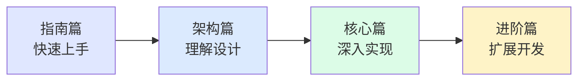

# 概览

欢迎来到 **Lowcode Engine 源码深度解析** 文档站。本文档旨在深入剖析阿里巴巴开源的 Lowcode Engine 源码，帮助你理解其架构设计、核心模块实现以及扩展机制。

## 📚 关于 Lowcode Engine

[Lowcode Engine](https://github.com/alibaba/lowcode-engine) 是阿里巴巴开源的一套企业级的低代码引擎解决方案，基于 **阿里巴巴内部多年的低代码技术积累** 构建，提供了完整的低代码应用搭建能力。

### 核心特性

- 🎨 **可视化设计** - 拖拽式组件编排，所见即所得的设计体验
- 🔌 **插件化架构** - 基于插件系统的高度可扩展设计
- 📦 **物料体系** - 完善的物料描述协议和组件市场体系
- 🏗️ **Monorepo 管理** - 模块化的包管理，清晰的责任边界
- 🚀 **渲染引擎** - 高效的页面渲染和组件渲染能力
- 🛠️ **扩展能力** - 支持自定义插件、自定义渲染器、自定义物料

## 🗂️ 文档结构

本文档站的内容组织如下：

### 💡 指南篇

适合初次接触 Lowcode Engine 源码的开发者：

- **[概览](/guide/overview)** - 了解整体内容和学习路径
- **[快速开始](/guide/quick-start)** - 快速开始源码阅读和调试
- **[源码结构](/guide/source-structure)** - 了解源码目录组织
- **[调试指南](/guide/debugging)** - 源码调试方法和技巧

### 🏗️ 架构篇

从架构视角理解 Lowcode Engine 的设计：

- **[整体架构](/architecture/overview)** - 系统整体架构和设计思想
- **[Monorepo 结构](/architecture/monorepo)** - Monorepo 项目管理实践
- **[编辑器核心](/architecture/editor-core)** - 编辑器核心模块设计
- **[渲染器架构](/architecture/renderer)** - 渲染引擎架构分析

### ⚙️ 核心篇

深入每个核心模块的源码实现：

- **[引擎核心](/core/engine-core)** - 引擎核心入口和 API
- **[设计器](/core/designer)** - 设计器模块源码解析
- **[骨架层](/core/skeleton)** - 骨架层和协议层设计
- **[工作区](/core/workspace)** - 工作区管理机制
- **[插件系统](/core/plugin-system)** - 插件系统设计
- **[物料系统](/core/material)** - 物料描述和封装
- **[设置器](/core/setters)** - 属性设置器实现
- **[Outline 树](/core/outline-tree)** - 页面结构树组件
- **[命令插件](/core/plugin-command)** - 命令系统实现
- **[页面组装器](/core/ignitor)** - 页面初始化和组装

### 🚀 进阶篇

扩展和自定义开发指南：

- **[自定义插件](/advanced/custom-plugin)** - 开发自定义插件
- **[自定义渲染器](/advanced/custom-renderer)** - 定制渲染逻辑
- **[物料开发](/advanced/material-development)** - 物料开发实践
- **[最佳实践](/advanced/best-practices)** - 使用建议和最佳实践
- **[常见问题](/advanced/faq)** - FAQ 和问题解答

## 🎯 学习路径



## 📖 前置知识

阅读本源码解析文档，建议具备以下知识：

- ✅ **JavaScript/TypeScript** - 熟悉 ES6+语法和 TypeScript 类型系统
- ✅ **React** - 理解 React 组件、Hooks、状态管理等概念
- ✅ **Node.js** - 了解 Node.js 环境和 npm 包管理
- ✅ **前端工程化** - 理解 Webpack、Babel等构建工具
- ✅ **设计模式** - 了解常见设计模式（观察者、工厂、策略等）

### 加分项

- 🌟 有低代码平台使用经验
- 🌟 了解 Monorepo 项目管理
- 🌟 熟悉 MobX 状态管理
- 🌟 有大型前端项目架构经验

## 🔍 源码获取

```bash
# 克隆官方源码仓库
git clone https://github.com/alibaba/lowcode-engine.git

# 进入项目目录
cd lowcode-engine

# 安装依赖
npm install

# 本地开发
npm run start
```

## 📝 版本说明

本文档基于 **Lowcode Engine v1.3.2** 版本进行分析。由于源码会持续迭代，部分内容可能随版本更新有所变化。

## 🤝 参与贡献

如果你发现文档有误或需要补充，欢迎通过以下方式参与：

- 📝 提交 Issue 反馈问题
- 🔀 提交 Pull Request 补充内容
- 💬 参与讨论和交流

---

下一篇：[快速开始 →](/guide/quick-start)