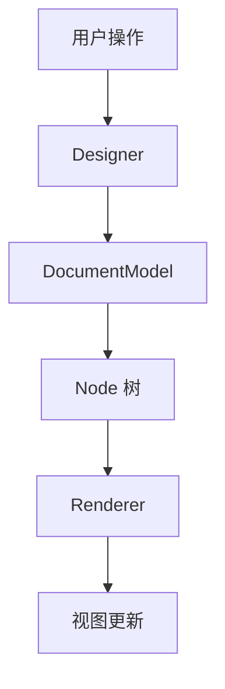

# 快速开始

本章节将帮助你快速搭建 Lowcode Engine 源码阅读和调试环境。

## 📋 前置要求

确保你的开发环境满足以下要求：

- Node.js >= 14.x
- npm >= 6.x 或 yarn >= 1.22.x
- Git >= 2.x
- VSCode（推荐）或其他现代 IDE

## 🔧 环境搭建

### 1. 克隆源码仓库

```bash
# 克隆官方仓库
git clone https://github.com/alibaba/lowcode-engine.git

# 进入项目目录
cd lowcode-engine

# 查看当前版本
git tag -l | grep "1.3"
```

### 2. 安装依赖

```bash
# 使用 npm
npm install

# 或使用 yarn
yarn install
```

### 3. 构建项目

```bash
# 构建所有包
npm run build

# 或构建指定包
npm run build -- --scope=@alilc/lowcode-engine
```

### 4. 启动开发服务器

```bash
# 启动本地开发
npm run start
```

启动成功后，访问 `http://localhost:5556` 查看演示页面。

## 📁 项目结构

```
lowcode-engine/
├── packages/                 # 核心代码包
│   ├── engine/              # 🎯 引擎核心（统一入口）
│   ├── editor-core/         # 编辑器核心 API
│   ├── designer/            # 设计器模块
│   ├── editor-skeleton/     # 骨架层定义
│   ├── renderer-core/       # 渲染器核心
│   ├── workspace/           # 工作区管理
│   ├── plugin-command/      # 命令插件
│   ├── plugin-designer/     # 设计器插件
│   ├── plugin-outline-pane/ # 大纲树插件
│   ├── react-renderer/      # React 渲染器
│   ├── react-simulator-renderer/ # React 模拟器渲染器
│   ├── types/               # TypeScript 类型定义
│   ├── utils/               # 工具函数
│   └── shell/               # Shell API
├── modules/                  # 示例模块
│   ├── materials/           # 物料示例
│   └── plugins/             # 插件示例
├── scripts/                  # 构建脚本
├── docs/                     # 官方文档
└── deploy-space/            # 部署配置
```

## 🔍 源码阅读方法

### 1. 从入口开始

推荐阅读顺序：

```
packages/engine/src/index.ts          # 引擎入口
  └─> packages/editor-core/src/       # 核心 API
       └─> packages/designer/src/     # 设计器实现
```

### 2. 关注核心类

- **Engine** - 引擎主类
- **Designer** - 设计器实例
- **Project** - 项目模型
- **DocumentModel** - 文档模型
- **Node** - 节点模型

### 3. 理解数据流



## 🐛 调试技巧

### Chrome DevTools 调试

1. 在 VSCode 中设置断点
2. 运行 `npm run start`
3. 在 Chrome 中打开 `http://localhost:5556`
4. 打开 DevTools（F12）
5. 在 Sources 面板找到源码并调试

### 源码映射配置

确保 `tsconfig.json` 中配置：

```json
{
  "compilerOptions": {
    "sourceMap": true,
    "inlineSourceMap": false,
    "declaration": true
  }
}
```

### 调试示例

```javascript
// 在关键位置添加断点
import { init } from '@alilc/lowcode-engine';

// 在此处打断点观察 engine 实例
const engine = await init(document.getElementById('lce-container'), {
  // 配置项...
});
```

## 📚 推荐工具

| 工具 | 用途 |
|------|------|
| VSCode + TypeScript | 代码阅读和编辑 |
| Chrome DevTools | 运行时调试 |
| React Developer Tools | React 组件树查看 |
| Sourcegraph | 在线源码浏览 |
| GitLens | Git 历史追溯 |

## 🎯 下一步

- 阅读 [源码结构](/guide/source-structure) 了解详细的目录组织
- 阅读 [调试指南](/guide/debugging) 学习高级调试技巧
- 阅读 [整体架构](/architecture/overview) 理解设计思想

---

上一篇：[概览](/guide/overview) · 下一篇：[源码结构](/guide/source-structure)